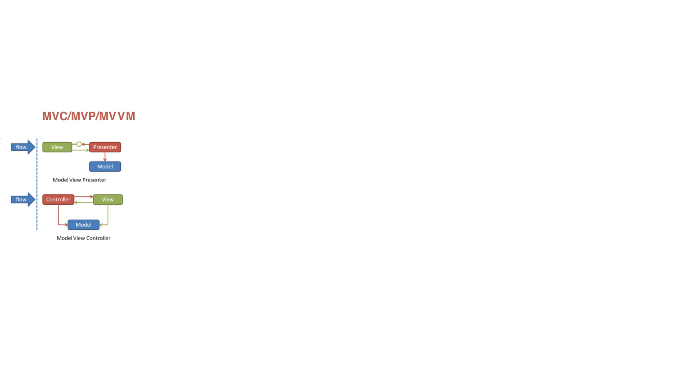

## MVC
M:Module 业务逻辑
V:view	 对应XML 界面展示
C:control 控制 

V 可以直接访问M

## MVP
M: 业务逻辑和实体模型
V:对应Activity view的绘制及与用户交互
P:负责完成View于Model间的交互

V不可以访问M层

## MVVM
View: 对应Activity 和XML  不包括业务逻辑
Model :实体模型 提供数据接口
VoewModel 负责完成View于Model间的交互,负责业务逻辑

## Android 插件化

1.动态加载apk

2资源加载

3代码加载 

## 热更新

## 进程宝活

038880768177

6657972

